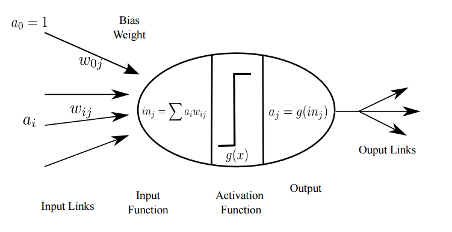

```{r setup, include=FALSE}
knitr::opts_chunk$set(echo = FALSE)
```
## A Neuron Model {.smaller .columns-2}


## A Neuron Model

- The weights of the neuron are the parameters of the model.
- The input is computed as a weighted sum of the inputs.
- The activation function determines the output and can be different functions.
- The output is obtained by applying the activation function to the input.
- How does the neuron work?

## A Neuron Model


## Single-layer Neural Network 


## Single-layer Neural Network 

## Multiple-layer Neural Network 


## The Back-Propagation Algorithm

## Two-Column Attempt {.smaller}

<div class="columns-2">
Base graphics can be quick...

```{r, fig.width = 3, fig.height = 4}
par_opts <- names(par())
    hist(nchar(par_opts),
         breaks = seq(1.5, 9.5, by = 1))
```

But `ggplot2` can be quick too:

```{r, fig.width = 2.5, fig.height = 2.5}
require(ggplot2, quietly = T)
qplot(factor(nchar(par_opts)))
```
</div>

## Two-Column Attempt: Taller Hist {.smaller}

<div class="columns-2">
Base graphics can be quick...

```{r, fig.width = 3, fig.height = 6}
par_opts <- names(par())
    hist(nchar(par_opts),
         breaks = seq(1.5, 9.5, by = 1))
```

But `ggplot2` can be quick too:

```{r, fig.width = 2.5, fig.height = 2.5}
require(ggplot2, quietly = T)
qplot(factor(nchar(par_opts)))
```
</div>

## Two-Column Attempt: Extra div {.smaller}

<div class="columns-2">

Base graphics can be quick...

```{r, fig.width = 3, fig.height = 4}
par_opts <- names(par())
    hist(nchar(par_opts),
         breaks = seq(1.5, 9.5, by = 1))
```

<div>
...
</div>

But `ggplot2` can be quick too:

```{r, fig.width = 2.5, fig.height = 2.5}
require(ggplot2, quietly = T)
qplot(factor(nchar(par_opts)))
```
</div>